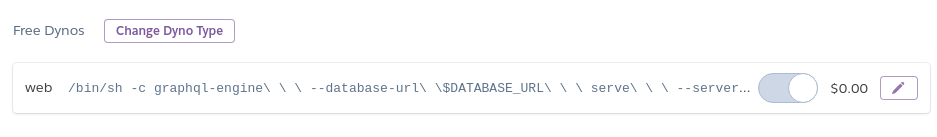

Oh right, we might move it somewhere else, but
I kinda need the database to unblock myself.

Since we're migrating out of `zm-backend` repo, and there's no db setup in `backend`, I'll just
keep the database here.

---

# Setup

## Create the app

```
heroku create zagrajmy-db-dev --stack=container
```

## Add Postgres addon

```
heroku addons:create heroku-postgresql:hobby-dev -a zagrajmy-db-dev
```

## Push to Heroku

```
yarn db:deploy
```

## Turn on the dyno



## See the logs

**https://dashboard.heroku.com/apps/zagrajmy-db-dev/logs**

## Kill stuck builds

```
heroku plugins:install heroku-builds
heroku builds:cancel -a zagrajmy-db-dev
```

# Migrations with Hasura CLI

https://hasura.io/docs/1.0/graphql/manual/migrations/new-database.html
